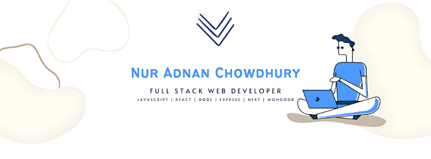

<h1 align="center">
  <a href="https://git.io/typing-svg">
    
  </a>
</h1>

<div align="center">
  <strong>Full Stack Web Developer
Full Stack Web Developer 👋 | Expert in JavaScript, React.js, Typescript, Node.js, & Express.js 🌍 | Building High-Performance Dynamic Web App with React, Redux, Next.js, Tailwind CSS, Node.js, & Express.js 🎨 </strong>
</div>
<br/>
<div align="center">
  <a href="https://www.linkedin.com/in/nur-adnan/"></a>
  <a href="https://daily.dev/"></a>
  <a href="https://nur-adnan-chowdhury.web.app"></a>
  <a href="https://x.com/NurAdnanChowdhu"></a>
  <a href="https://instagram.com/nur_adnan"></a>
  <a href="mailto:nuradnanchowdhury015@gmail.com"></a>
</div>
<hr/>


### Talking about Personal Stuff:

- 🛠 &nbsp; I’m currently working with <strong>JS, TS, AWS.</strong>
- 🚀 &nbsp; I’m currently exploring <strong>Blockchain.</strong>
- 📫 &nbsp; Reach me out: <strong>nuradnanchowdhury015@gmail.com.</strong>

### My Absolute Favorites:
- 💻 &nbsp; I love exploring new technologies and building cool stuff.
- 🍕 &nbsp; Meetups & Tech Events & Hackathons.

<hr/>

<h2 align="center">🔥 Languages & Frameworks & Tools 🔥</h2>

<div align="center">
  <code></code>
  <code></code>
  <code></code>
  <code></code>
  <code></code>
  <code></code>
  <code></code>
  <code></code>
  <code></code>
  <code></code>
  <code></code>
  <code></code>
  <code></code>
  <code></code>
  <code></code>
  <code></code>
</div>

<br/>

```javascript
const nurAdnan = {
  pronouns: "he/him",
  code: ["JavaScript", "TypeScript", "HTML", "CSS"],
  tools: ["React", "Redux", "Node.js", "Styled-Components", "Jest", "Docker"],
  architecture: ["microservices", "event-driven", "design system pattern"],
  techCommunities: {
    coorganizer: "East-West-University",
    speaker: "English",
    mentor: "Web Developer"
  },
  challenge: "I am doing the #100DaysOfCode challenge focused on React and TypeScript"
}
```


